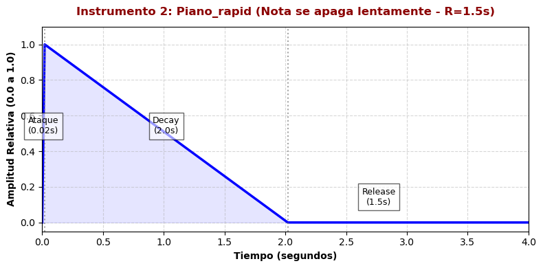
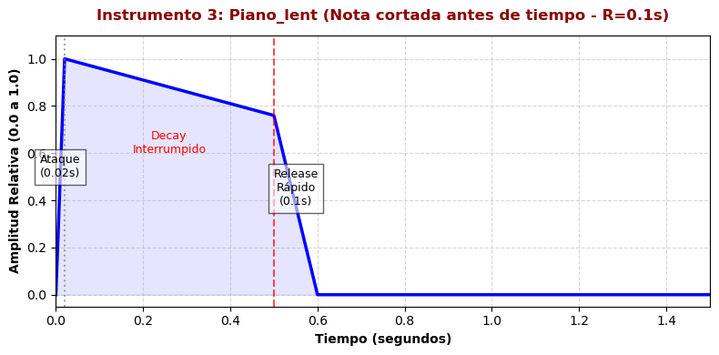
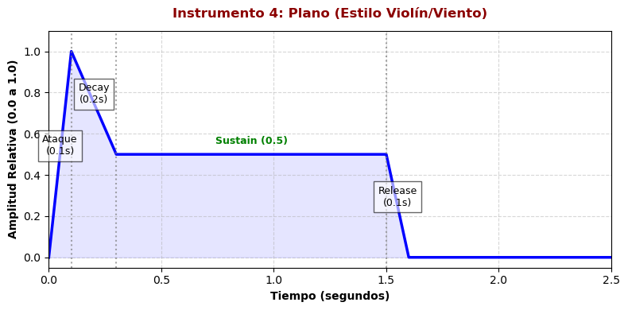
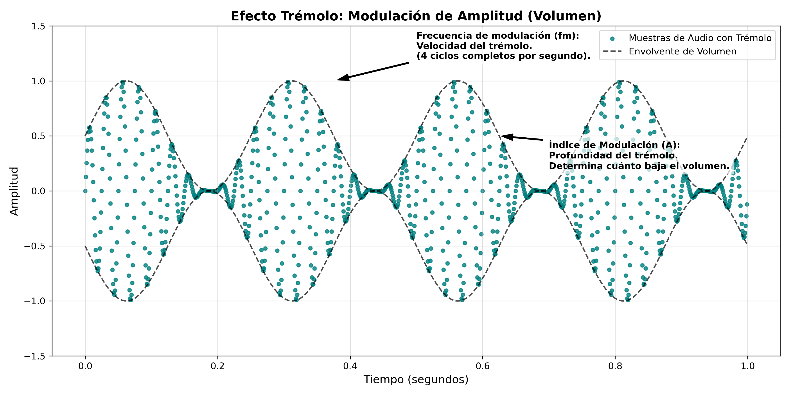
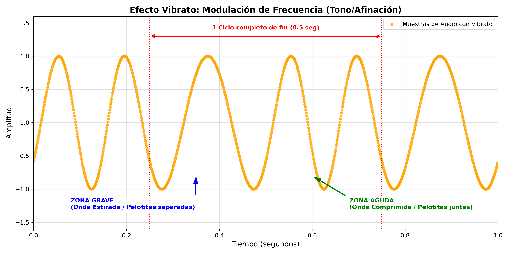
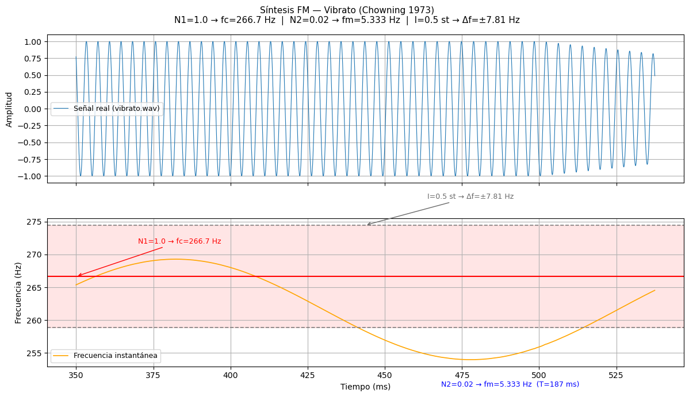

PAV - P5: síntesis musical polifónica
=====================================

Obtenga su copia del repositorio de la práctica accediendo a [Práctica 5](https://github.com/albino-pav/P5) 
y pulsando sobre el botón `Fork` situado en la esquina superior derecha. A continuación, siga las
instrucciones de la [Práctica 2](https://github.com/albino-pav/P2) para crear una rama con el apellido de
los integrantes del grupo de prácticas, dar de alta al resto de integrantes como colaboradores del proyecto
y crear la copias locales del repositorio.

Como entrega deberá realizar un *pull request* con el contenido de su copia del repositorio. Recuerde que
los ficheros entregados deberán estar en condiciones de ser ejecutados con sólo ejecutar:

~~~~~~~~~~~~~~~~~~~~~~~~~~~~~~~~~~~~~~~~~~~~~~~~~~~~~.sh
  make release
~~~~~~~~~~~~~~~~~~~~~~~~~~~~~~~~~~~~~~~~~~~~~~~~~~~~~

A modo de memoria de la práctica, complete, en este mismo documento y usando el formato *markdown*, los
ejercicios indicados.

Ejercicios.
-----------

### Envolvente ADSR.

Tomando como modelo un instrumento sencillo (puede usar el InstrumentDumb), genere cuatro instrumentos que
permitan visualizar el funcionamiento de la curva ADSR.

* Un instrumento con una envolvente ADSR genérica, para el que se aprecie con claridad cada uno de sus
  parámetros: ataque (A), caída (D), mantenimiento (S) y liberación (R).
* Un instrumento *percusivo*, como una guitarra o un piano, en el que el sonido tenga un ataque rápido, no
  haya mantenimiemto y el sonido se apague lentamente.
  - Para un instrumento de este tipo, tenemos dos situaciones posibles:
    * El intérprete mantiene la nota *pulsada* hasta su completa extinción.
    * El intérprete da por finalizada la nota antes de su completa extinción, iniciándose una disminución
	  abrupta del sonido hasta su finalización.
  - Debera representar en esta memoria **ambos** posibles finales de la nota.
* Un instrumento *plano*, como los de cuerdas frotadas (violines y semejantes) o algunos de viento. En
  ellos, el ataque es relativamente rápido hasta alcanzar el nivel de mantenimiento (sin sobrecarga), y la
  liberación también es bastante rápida.

Para los cuatro casos, deberá incluir una gráfica en la que se visualice claramente la curva ADSR. Deberá
añadir la información necesaria para su correcta interpretación, aunque esa información puede reducirse a
colocar etiquetas y títulos adecuados en la propia gráfica (se valorará positivamente esta alternativa).


### Gráficas de las Envolventes ADSR

  #### 1. Instrumento Genérico
  

  #### 2. Piano Rápido (Extinción Lenta)
  

  #### 3. Piano Lento (Nota Cortada)
  

  #### 4. Instrumento Plano
  


### Instrumentos Dumb y Seno.

Implemente el instrumento `Seno` tomando como modelo el `InstrumentDumb`. La señal **deberá** formarse
mediante búsqueda de los valores en una tabla.

- Incluya, a continuación, el código del fichero `seno.cpp` con los métodos de la clase Seno.

  ```cpp
    #include <iostream>
    #include <math.h>
    #include "seno.h"
    #include "keyvalue.h"
    #include <stdlib.h>

    using namespace upc;
    using namespace std;

    // Constructor: Inicializa la tabla de ondas con un ciclo de seno
    Seno::Seno(const std::string &param) 
      : adsr(SamplingRate, param) {
      bActive = false;
      x.resize(BSIZE);

      KeyValue kv(param);
      int N;

      if (!kv.to_int("N", N)) 
        N = 40; // Valor por defecto si no encuentra N
      
      tbl.resize(N);
      float phase_init = 0, step_init = 2 * M_PI / (float)N;
      
      for (int i = 0; i < N; ++i) {
        tbl[i] = sin(phase_init);
        phase_init += step_init;
      }
      phase = 0;
    }

    // Gestión de eventos MIDI (pulsar/soltar tecla)
    void Seno::command(long cmd, long note, long vel) {
      if (cmd == 9) {   // Key pressed: inicia el ataque
        bActive = true;
        adsr.start();
        A = vel / 127.0;
        // Cálculo del incremento de fase posicional según la frecuencia de la nota
        this->step = 440 * pow(2, (note - 69) / 12.0) * tbl.size() / SamplingRate;
      }
      else if (cmd == 8) {  // Key released: inicia el release
        adsr.stop();
      }
      else if (cmd == 0) {  // Extinción inmediata
        adsr.end();
      }
    }

    // Generación de las muestras de audio
    const vector<float> & Seno::synthesize() {
      if (not adsr.active()) {
        x.assign(x.size(), 0);
        bActive = false;
        return x;
      }
      else if (not bActive)
        return x;

      for (unsigned int i = 0; i < x.size(); ++i) {
        // Lectura de la tabla mediante el método de redondeo al entero más cercano
        x[i] = A * tbl[(int)(phase + 0.5)];
        phase += step;
        
        // Bucle circular para mantener la fase dentro de los límites de la tabla
        while (phase >= tbl.size() - 0.5) {
          phase -= tbl.size();
        }
      }
      
      adsr(x); // Aplica la envolvente ADSR al bloque de audio generado

      return x;
    }
  ```


- Explique qué método se ha seguido para asignar un valor a la señal a partir de los contenidos en la tabla, e incluya una gráfica en la que se vean claramente (use pelotitas en lugar de líneas) los valores de la tabla y los de la señal generada.


    Para asignar un valor a la señal de audio a partir de los contenidos discretos de la tabla de ondas (tbl), el instrumento utiliza el método de Redondeo de Fase al entero más cercano. Como el incremento que tiene la fase es un valor decimal, puede ser que la variable phase acabe teniendo valores no enteros. Como el acceso a los índices de un vector en C++ necesita un valor entero lo que hace el programa es rendondear al entero inferior más cercano. De esta forma, si el valor de la fase es 2,2 o 2,8 el vector le asignará el valor de 2, cuando 2,8 se aproxima más a 3. Para evitar esto lo que se hace es sumarle 0,5 para que el valor de la fase se acabe redondeando al entero más cercano:

    ```cpp
      x[i] = A * tbl[(int)(phase + 0.5)];
    ```

    Esta es la gráfica en la que se ven claramente los valores de la tabla y los de la señal generada:

    Se puede observar como los puntos de color azul representan el contenido estático y fijo almacenado en la tabla de ondas (tbl), y se ve la forma de un ciclo discreto de la función senosoidal pura. Por otro lado, las pelotitas de color rojo representan las muestras consecutivas de la señal de audio generadas en el tiempo por el método synthesize(). Como el incremento de fase (step) es mayor que 1, el motor de audio lee la tabla saltándose posiciones de manera indexada, logrando así generar una señal periódica de una frecuencia superior (más aguda).

    


- Si ha implementado la síntesis por tabla almacenada en fichero externo, incluya a continuación el código
  del método `command()`.

  Como no se realiza una lectura de archivos de audio externos (como archivos de texto con muestras o ficheros .wav), no se ha implementado la síntesis por fichero externo, por lo que el método command() no requiere de nada adicional.


### Efectos sonoros.

- Incluya dos gráficas en las que se vean, claramente, el efecto del trémolo y el vibrato sobre una señal
  sinusoidal. Deberá explicar detalladamente cómo se manifiestan los parámetros del efecto (frecuencia e
  índice de modulación) en la señal generada (se valorará que la explicación esté contenida en las propias
  gráficas, sin necesidad de mucha *literatura*).

    El trémolo es un efecto que consiste en variar el volumen (la amplitud) de una señal de forma periódica y automática. En cambio, el vibrato es una técnica que consiste en variar la afinación (la frecuencia) de un sonido de forma periódica, rápida y sutil. 

    

    Se puede ver como la aplitud de la onda va aumentando y disminuyendo, porque está cambiando el volumen del señal

    

    Aquí se ve como en un ciclo la longitud de onda va cambiando haciendo que cambie la nota.

- Si ha generado algún efecto por su cuenta, explique en qué consiste, cómo lo ha implementado y qué
  resultado ha producido. Incluya, en el directorio `work/ejemplos`, los ficheros necesarios para apreciar
  el efecto, e indique, a continuación, la orden necesaria para generar los ficheros de audio usando el
  programa `synth`.
    
    ### Efecto Custom: Delay (Eco)
    *   **En qué consiste:** Es un efecto de retardo o eco. Básicamente guarda las muestras que van entrando en un buffer para reproducirlas un poco más tarde mezcladas con el sonido original. Los parámetros que usa son:
      *   `time`: El retraso en segundos entre cada repetición.
      *   `feedback`: Cuánto volumen mantiene el eco en cada repetición (para que se vaya apagando poco a poco).
      *   `mix`: La proporción de mezcla entre el sonido original limpio y el sonido con el eco.

    *   **Cómo se ha implementado:** Hemos programado la clase `Delay` en C++ (heredando de `Effect`) repartida en estos archivos:
      *   `delay.h`: Define las variables del efecto (`time`, `feedback`, `mix`), el búfer (`std::vector<float>`) y el puntero de escritura circular.
        *   `delay.cpp`: 
        *   **Constructor:** Reserva el tamaño del búfer según el retardo y la frecuencia de muestreo ($N = \text{time} \times 44100$).
        *   **`operator()` (Procesamiento):** Implementa el bucle del búfer circular. Lee la muestra retardada, calcula la salida mezclando la señal limpia y con eco (`mix`), y guarda en el búfer la entrada sumada al eco atenuado (`feedback`) para la siguiente repetición.
        *   `effect.cpp`: Registramos el efecto en `get_effect()` para poder instanciarlo con la palabra `"Delay"`.
        *   `meson.build`: Añadimos `effects/delay.cpp` a las fuentes para compilar con `make release`.
 
    *   **Resultado y observaciones:** El efecto hace que la melodía suene con más profundidad y eco. Un detalle importante que vimos al probarlo es que el sintetizador deja de aplicar efectos a una nota cuando su envolvente ADSR termina la fase de release (`ADSR_R`). Por eso, si el release de la nota es muy corto (por ejemplo 0.2s) y el delay es de 0.25s, el instrumento se desactiva y el eco se corta de golpe. Para solucionarlo, hay que poner un release más largo en el instrumento (por ejemplo `ADSR_R=1.5`) para dejar que suenen las repeticiones del delay.


    
    Estando dentro del directorio work/ejemplos, la orden para generar los ficheros de audio es la siguiente:

  ```sh
    ~/PAV/bin/synth -e efectos_eco.orc instrumentos_eco.orc partitura_eco.sco resultat_eco.wav
  ```

### Síntesis FM.

Construya un instrumento de síntesis FM, según las explicaciones contenidas en el enunciado y el artículo
de [John M. Chowning](https://web.eecs.umich.edu/~fessler/course/100/misc/chowning-73-tso.pdf). El
instrumento usará como parámetros **básicos** los números `N1` y `N2`, y el índice de modulación `I`, que
deberá venir expresado en semitonos.

- Use el instrumento para generar un vibrato de *parámetros razonables* e incluya una gráfica en la que se
  vea, claramente, la correspondencia entre los valores `N1`, `N2` e `I` con la señal obtenida.


    N1 define la frecuencia de la portadora: fc = N1 · f0. Con N1=1, la nota que suenas es exactamente f0.
    N2 define la frecuencia de la moduladora: fm = N2 · f0. En vibrato, fm es la velocidad del vibrato (cuántas veces por segundo oscila el tono).
    I (en semitonos) define cuánto se desvía el tono. 

    En este caso, en la gráfica superior se puede observar la señal en el dominio del tiempo (los ciclos de la onda sonora a 267 Hz aproximadamente). Va tan rápido que no se puede ver el vibrato directamente, solo se ve una masa de oscilaciones.

    En cambio, en la parte inferior se pude ver la frecuencia instantánea: muestra cómo varía la frecuencia a lo largo del tiempo. Aquí sí se ve el vibrato claramente, ya que se puede ver como la curva naranja sube y baja lentamente a ritmo de fm=5.3 Hz.

    

- Use el instrumento para generar un sonido tipo clarinete y otro tipo campana. Tome los parámetros del
  sonido (N1, N2 e I) y de la envolvente ADSR del citado artículo. Con estos sonidos, genere sendas escalas
  diatónicas (fichero `doremi.sco`) y ponga el resultado en los ficheros `work/doremi/clarinete.wav` y
  `work/doremi/campana.work`.
  * También puede colgar en el directorio work/doremi otras escalas usando sonidos *interesantes*. Por
    ejemplo, violines, pianos, percusiones, espadas láser de la
	[Guerra de las Galaxias](https://www.starwars.com/), etc.
 
  #### Creación de los instrumentos 

    En la carpeta work/doremi se pueden observar algunos ficheros .wav representando a diferentes instrumentos. Hemos creado el clarinete, la campana, el piano, el violín, la percusión y el fagot.


### Orquestación usando el programa synth.

Use el programa `synth` para generar canciones a partir de su partitura MIDI. Como mínimo, deberá incluir la *orquestación* de la canción *You've got a friend in me* (fichero `ToyStory_A_Friend_in_me.sco`) del genial [Randy Newman](https://open.spotify.com/artist/3HQyFCFFfJO3KKBlUfZsyW/about).

- En este triste arreglo, la pista 1 corresponde al instrumento solista (puede ser un piano, flauta,
  violín, etc.), y la 2 al bajo (bajo eléctrico, contrabajo, tuba, etc.).
- Coloque el resultado, junto con los ficheros necesarios para generarlo, en el directorio `work/music`.

- Indique, a continuación, la orden necesaria para generar la señal (suponiendo que todos los archivos
  necesarios están en el directorio indicado).

  #### Creación de los instrumentos

  Para la orquestación del tema *You've got a friend in me*, se ha configurado un arreglo polifónico a dos pistas en el archivo `toystory.orc`. El objetivo de los parámetros seleccionados es simular un **piano** para la línea melódica principal y un **fagot** (instrumento de viento madera grave) para el acompañamiento:

  #### Canal 1: Melodía (Simulación de Piano)
  ```cpp
      1   FMSynth     N1=1.0; N2=1.0; I=6.0; ADSR_A=0.01; ADSR_D=1.5; ADSR_S=0.15; ADSR_R=0.4; N=40;`
  ```
    *   **`N1=1.0; N2=1.0` (Relación 1:1):** Espectro armónico limpio y natural para simular cuerdas vibrantes.
    *   **`I=6.0` (Índice de modulación):** Brillo moderado que imita el golpe del martillo del piano contra la cuerda.
    *   **`ADSR_A=0.01` (Ataque rápido):** Comienzo casi instantáneo (10 ms) típico de la percusión en un piano.
    *   **`ADSR_D=1.5; ADSR_S=0.15` (Decay largo y Sustain bajo):** El sonido disminuye gradualmente tras el ataque hasta un volumen bajo (15%).
    *   **`ADSR_R=0.4` (Release rápido):** Apagado natural de la cuerda (400 ms) al soltar la tecla.
    *   **`N=40`:** Tamaño de la tabla (mantenido por compatibilidad de lectura del programa).

  #### Canal 2: Bajo (Simulación de Fagot)
    ```cpp
          2   FMSynth     N1=1.0; N2=0.5; I=8.0; ADSR_A=0.08; ADSR_D=0.4; ADSR_S=0.7; ADSR_R=0.3; N=40;`
    ```
    
    *   **`N1=1.0; N2=0.5` (Relación 1:0.5):** Genera subarmónicos graves para dar el sonido con cuerpo y madera típico del fagot.
    *   **`I=8.0` (Índice de modulación):** Aumenta los armónicos medios para dar definición al bajo dentro de la mezcla general.
    *   **`ADSR_A=0.08` (Ataque intermedio):** Retardo de 80 ms simulando la entrada de aire y vibración de la lengüeta en un viento madera.
    *   **`ADSR_D=0.4; ADSR_S=0.7` (Decay rápido y Sustain alto):** Mantiene la nota de bajo con volumen constante (70%) mientras se sostiene.
    *   **`ADSR_R=0.3` (Release rápido):** Extinción ágil del sonido (300 ms) para evitar que las notas graves se solapen.

  #### Generación de la señal

   Si estamos en el directorio general, es decir PAV/P5 el comando es el siguiente:
    ```sh
        ~/PAV/bin/synth -g 0.3 work/music/toystory.orc work/music/ToyStory_A_Friend_in_me.sco work/music/toystory.wav     
    ```
    Estando en el directorio work/music/ el comando es :
    ```sh
      ~/PAV/bin/synth -g 0.3 toystory.orc ToyStory_A_Friend_in_me.sco toystory.wav 
    ```

    Esta orden ejecuta el programa synth para sintetizar el archivo de audio toystory.wav a partir de la partitura de notas (ToyStory_A_Friend_in_me.sco) y la asignación de instrumentos de la orquesta (toystory.orc). Se ha incluido el parámetro de ganancia -g 0.3 porque, al sonar el solista y el bajo simultáneamente, la suma de ambas señales superaba la amplitud máxima digital de 1.0, provocando saturación y distorsión (clipping). Con un factor de 0.3 se atenúa la mezcla final para garantizar un sonido limpio y sin ruido.

También puede orquestar otros temas más complejos, como la banda sonora de *Hawaii5-0* o el villacinco de
John Lennon *Happy Xmas (War Is Over)* (fichero `The_Christmas_Song_Lennon.sco`), o cualquier otra canción
de su agrado o composición. Se valorará la riqueza instrumental, su modelado y el resultado final.
- Coloque los ficheros generados, junto a sus ficheros `score`, `instruments` y `efffects`, en el directorio
  `work/music`.
- Indique, a continuación, la orden necesaria para generar cada una de las señales usando los distintos
  ficheros.

  ### Orquestación opcional: One Day More (Les Misérables)
  
    Instrumentos (onedaymore.orc)

    Todos los instrumentos utilizan síntesis FM (FMSynth). Los parámetros N1, N2 e I controlan el timbre: N1/N2 definen la relación portadora/moduladora e I el índice de modulación (lo "rico" que es el espectro armónico).

    Como hay muchos canales, se ha optado por un ataque y caída (decay) más largos para los canales principales (clarinete, violín, flauta y trompa) y un ataque más corto para los canales secundarios (saxofón, trompeta y trombón). Los valores de ADSR_A, ADSR_D, ADSR_S y ADSR_R se han ajustado para conseguir un sonido más natural y expresivo.

    - Canal 3 — Piano acústico : Acompañamiento armónico principal. I=2.5 y decay largo para simular el resonador del piano.
    - Canal 11 — Clarinete : Voz de Jean Valjean. N2=3.0 para un timbre de viento-madera, release largo para frases legato.
    - Canal 12 — Violín : Voz de Marius & Cosette. I baja (1.5) y attack suave para un sonido romántico y cálido.
    - Canal 13 — Flauta : Voz de Éponine. I=1.2, el más suave de las voces, para transmitir fragilidad.
    - Canal 14 — Trompa francesa : Voz de Javert. I=4.0, ataque rápido y sonido duro para reflejar su carácter autoritario.
    - Canal 15 — Saxofón tenor : Thénardier. I=5.0 para un timbre grotesco y exagerado, coherente con el personaje.
    - Canal 16 — Trompeta : Enjolras. I=5.5, muy brillante, carácter heroico y directo.
    - Canal 17 — Trombón : Estudiantes rebeldes. N2=1.5, potente y metálico, representando el grupo como bloque.
    - Canal 18 — Flauta orquestal : I=0.8, el valor más bajo de todos, sonido casi sinusoidal y aéreo.
    - Canal 19 — Cuerdas : Sección de cuerdas. Attack=0.20 y release=0.40 para un legato orquestal real, sin clics.
    - Canal 20 — Cuerdas pizzicato : Notas de tan solo 30 ticks (~0.2s). Attack=0.005 y decay corto para adaptarse a esta duración y sonar como un pizzicato o arpa.
    - Canal 21 — Contrabajo : Bajo orquestal. Decay=0.4, base armónica de notas largas.
    - Canal 22 — Sección de metales : Brass tutti. I=5.0, gran presencia espectral para los momentos épicos.
    - Canal 23 — Campanillas : Efecto orquestal puntual. N2=7.0 e I=8.0 para un sonido inarmónico de campanilla.
    - Canal 24 — Pad orquestal: Relleno armónico de fondo. Attack=0.10, suave, refuerza la armonía sin destacar.
    
    La orden para generar la señal es la siguiente (ejecutada desde el directorio `work/music/`):
    ```sh
      ~/PAV/bin/synth -b 100 -t 74 -g 0.02 onedaymore.orc onedaymore.sco onedaymore.wav    
    ```
    Parámetros globales:

    *  -b 100: Velocidad o Tempo en pulsos por minuto (BPM). Establece el ritmo base de la partitura. Un valor mayor haría que la canción sonara demasiado rápida, impidiendo distinguir las notas y la melodía.
    *  -t 74: Resolución temporal en Ticks Per Beat (TPB) extraída directamente del fichero MIDI original. Utilizar cualquier otro valor alteraría las proporciones de las duraciones de las notas y desincronizaría la partitura.
    *  -g 0.02: Ganancia global de 0.02. Con 15 canales activos a la vez, la suma de amplitudes superaría fácilmente 1.0 y produciría saturación, por lo que atenuamos la mezcla final.


> NOTA:
>
> No olvide escuchar el resultado generado y comprobar que no se producen ruidos extraños o distorsiones.
> Sobre todo, tenga en cuenta la salud auditiva de quien será encargado de corregir su trabajo.
