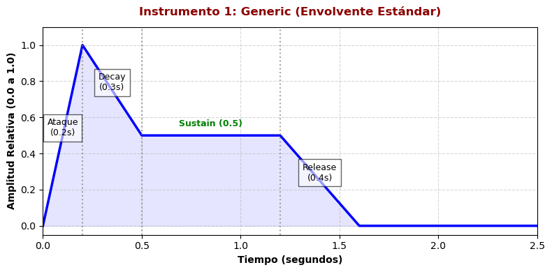
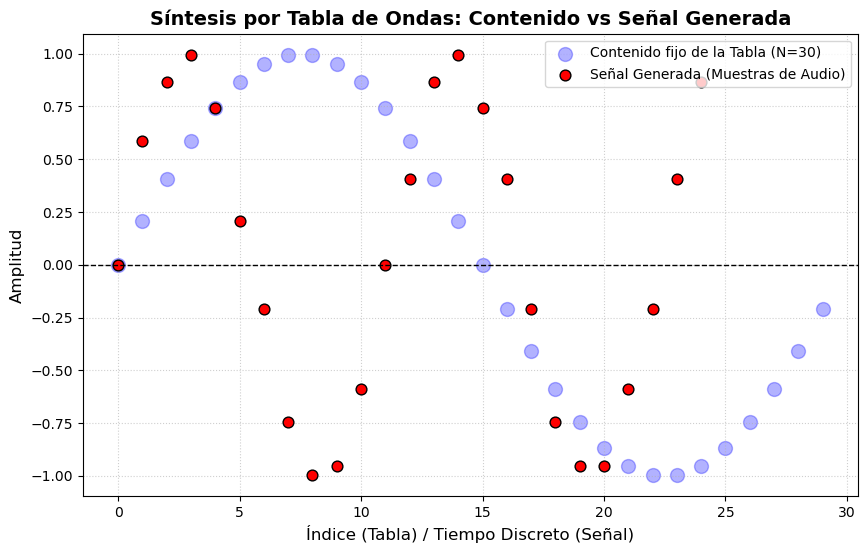

PAV - P5: síntesis musical polifónica
=====================================

Obtenga su copia del repositorio de la práctica accediendo a [Práctica 5](https://github.com/albino-pav/P5) 
y pulsando sobre el botón `Fork` situado en la esquina superior derecha. A continuación, siga las
instrucciones de la [Práctica 2](https://github.com/albino-pav/P2) para crear una rama con el apellido de
los integrantes del grupo de prácticas, dar de alta al resto de integrantes como colaboradores del proyecto
y crear la copias locales del repositorio.

Como entrega deberá realizar un *pull request* con el contenido de su copia del repositorio. Recuerde que
los ficheros entregados deberán estar en condiciones de ser ejecutados con sólo ejecutar:

~~~~~~~~~~~~~~~~~~~~~~~~~~~~~~~~~~~~~~~~~~~~~~~~~~~~~.sh
  make release
~~~~~~~~~~~~~~~~~~~~~~~~~~~~~~~~~~~~~~~~~~~~~~~~~~~~~

A modo de memoria de la práctica, complete, en este mismo documento y usando el formato *markdown*, los
ejercicios indicados.

Ejercicios.
-----------

### Envolvente ADSR.

Tomando como modelo un instrumento sencillo (puede usar el InstrumentDumb), genere cuatro instrumentos que
permitan visualizar el funcionamiento de la curva ADSR.

* Un instrumento con una envolvente ADSR genérica, para el que se aprecie con claridad cada uno de sus
  parámetros: ataque (A), caída (D), mantenimiento (S) y liberación (R).
* Un instrumento *percusivo*, como una guitarra o un piano, en el que el sonido tenga un ataque rápido, no
  haya mantenimiemto y el sonido se apague lentamente.
  - Para un instrumento de este tipo, tenemos dos situaciones posibles:
    * El intérprete mantiene la nota *pulsada* hasta su completa extinción.
    * El intérprete da por finalizada la nota antes de su completa extinción, iniciándose una disminución
	  abrupta del sonido hasta su finalización.
  - Debera representar en esta memoria **ambos** posibles finales de la nota.
* Un instrumento *plano*, como los de cuerdas frotadas (violines y semejantes) o algunos de viento. En
  ellos, el ataque es relativamente rápido hasta alcanzar el nivel de mantenimiento (sin sobrecarga), y la
  liberación también es bastante rápida.

Para los cuatro casos, deberá incluir una gráfica en la que se visualice claramente la curva ADSR. Deberá
añadir la información necesaria para su correcta interpretación, aunque esa información puede reducirse a
colocar etiquetas y títulos adecuados en la propia gráfica (se valorará positivamente esta alternativa).


## Gráficas de las Envolventes ADSR

## 1. Instrumento Genérico


## 2. Piano Rápido (Extinción Lenta)


## 3. Piano Lento (Nota Cortada)


## 4. Instrumento Plano


### Instrumentos Dumb y Seno.

Implemente el instrumento `Seno` tomando como modelo el `InstrumentDumb`. La señal **deberá** formarse
mediante búsqueda de los valores en una tabla.

- Incluya, a continuación, el código del fichero `seno.cpp` con los métodos de la clase Seno.

```cpp
#include <iostream>
#include <math.h>
#include "seno.h"
#include "keyvalue.h"
#include <stdlib.h>

using namespace upc;
using namespace std;

// Constructor: Inicializa la tabla de ondas con un ciclo de seno
Seno::Seno(const std::string &param) 
  : adsr(SamplingRate, param) {
  bActive = false;
  x.resize(BSIZE);

  KeyValue kv(param);
  int N;

  if (!kv.to_int("N", N)) 
    N = 40; // Valor por defecto si no encuentra N
  
  tbl.resize(N);
  float phase_init = 0, step_init = 2 * M_PI / (float)N;
  
  for (int i = 0; i < N; ++i) {
    tbl[i] = sin(phase_init);
    phase_init += step_init;
  }
  phase = 0;
}

// Gestión de eventos MIDI (pulsar/soltar tecla)
void Seno::command(long cmd, long note, long vel) {
  if (cmd == 9) {   // Key pressed: inicia el ataque
    bActive = true;
    adsr.start();
    A = vel / 127.0;
    // Cálculo del incremento de fase posicional según la frecuencia de la nota
    this->step = 440 * pow(2, (note - 69) / 12.0) * tbl.size() / SamplingRate;
  }
  else if (cmd == 8) {  // Key released: inicia el release
    adsr.stop();
  }
  else if (cmd == 0) {  // Extinción inmediata
    adsr.end();
  }
}

// Generación de las muestras de audio
const vector<float> & Seno::synthesize() {
  if (not adsr.active()) {
    x.assign(x.size(), 0);
    bActive = false;
    return x;
  }
  else if (not bActive)
    return x;

  for (unsigned int i = 0; i < x.size(); ++i) {
    // Lectura de la tabla mediante el método de redondeo al entero más cercano
    x[i] = A * tbl[(int)(phase + 0.5)];
    phase += step;
    
    // Bucle circular para mantener la fase dentro de los límites de la tabla
    while (phase >= tbl.size() - 0.5) {
      phase -= tbl.size();
    }
  }
  
  adsr(x); // Aplica la envolvente ADSR al bloque de audio generado

  return x;
}
```


- Explique qué método se ha seguido para asignar un valor a la señal a partir de los contenidos en la tabla,
  e incluya una gráfica en la que se vean claramente (use pelotitas en lugar de líneas) los valores de la
  tabla y los de la señal generada.


  Para asignar un valor a la señal de audio a partir de los contenidos discretos de la tabla de ondas (tbl), el instrumento utiliza el método de Redondeo de Fase al entero más cercano. Como el incremento que tiene la fase es un valor decimal, puede ser que la variable phase acabe teniendo valores no enteros. Como el acceso a los índices de un vector en C++ necesita un valor entero lo que hace el programa es rendondear al entero inferior más cercano. De esta forma, si el valor de la fase es 2,2 o 2,8 el vector le asignará el valor de 2, cuando 2,8 se aproxima más a 3. Para evitar esto lo que se hace es sumarle 0,5 para que el valor de la fase se acabe redondeando al entero más cercano:

  x[i] = A * tbl[(int)(phase + 0.5)];


  Esta es la gráfica en la que se ven claramente los valores de la tabla y los de la señal generada:

  


- Si ha implementado la síntesis por tabla almacenada en fichero externo, incluya a continuación el código
  del método `command()`.

### Efectos sonoros.

- Incluya dos gráficas en las que se vean, claramente, el efecto del trémolo y el vibrato sobre una señal
  sinusoidal. Deberá explicar detalladamente cómo se manifiestan los parámetros del efecto (frecuencia e
  índice de modulación) en la señal generada (se valorará que la explicación esté contenida en las propias
  gráficas, sin necesidad de mucha *literatura*).
- Si ha generado algún efecto por su cuenta, explique en qué consiste, cómo lo ha implementado y qué
  resultado ha producido. Incluya, en el directorio `work/ejemplos`, los ficheros necesarios para apreciar
  el efecto, e indique, a continuación, la orden necesaria para generar los ficheros de audio usando el
  programa `synth`.

### Síntesis FM.

Construya un instrumento de síntesis FM, según las explicaciones contenidas en el enunciado y el artículo
de [John M. Chowning](https://web.eecs.umich.edu/~fessler/course/100/misc/chowning-73-tso.pdf). El
instrumento usará como parámetros **básicos** los números `N1` y `N2`, y el índice de modulación `I`, que
deberá venir expresado en semitonos.

- Use el instrumento para generar un vibrato de *parámetros razonables* e incluya una gráfica en la que se
  vea, claramente, la correspondencia entre los valores `N1`, `N2` e `I` con la señal obtenida.
- Use el instrumento para generar un sonido tipo clarinete y otro tipo campana. Tome los parámetros del
  sonido (N1, N2 e I) y de la envolvente ADSR del citado artículo. Con estos sonidos, genere sendas escalas
  diatónicas (fichero `doremi.sco`) y ponga el resultado en los ficheros `work/doremi/clarinete.wav` y
  `work/doremi/campana.work`.
  * También puede colgar en el directorio work/doremi otras escalas usando sonidos *interesantes*. Por
    ejemplo, violines, pianos, percusiones, espadas láser de la
	[Guerra de las Galaxias](https://www.starwars.com/), etc.

### Orquestación usando el programa synth.

Use el programa `synth` para generar canciones a partir de su partitura MIDI. Como mínimo, deberá incluir la
*orquestación* de la canción *You've got a friend in me* (fichero `ToyStory_A_Friend_in_me.sco`) del genial
[Randy Newman](https://open.spotify.com/artist/3HQyFCFFfJO3KKBlUfZsyW/about).

- En este triste arreglo, la pista 1 corresponde al instrumento solista (puede ser un piano, flauta,
  violín, etc.), y la 2 al bajo (bajo eléctrico, contrabajo, tuba, etc.).
- Coloque el resultado, junto con los ficheros necesarios para generarlo, en el directorio `work/music`.
- Indique, a continuación, la orden necesaria para generar la señal (suponiendo que todos los archivos
  necesarios están en el directorio indicado).

También puede orquestar otros temas más complejos, como la banda sonora de *Hawaii5-0* o el villacinco de
John Lennon *Happy Xmas (War Is Over)* (fichero `The_Christmas_Song_Lennon.sco`), o cualquier otra canción
de su agrado o composición. Se valorará la riqueza instrumental, su modelado y el resultado final.
- Coloque los ficheros generados, junto a sus ficheros `score`, `instruments` y `efffects`, en el directorio
  `work/music`.
- Indique, a continuación, la orden necesaria para generar cada una de las señales usando los distintos
  ficheros.

> NOTA:
>
> No olvide escuchar el resultado generado y comprobar que no se producen ruidos extraños o distorsiones.
> Sobre todo, tenga en cuenta la salud auditiva de quien será encargado de corregir su trabajo.
